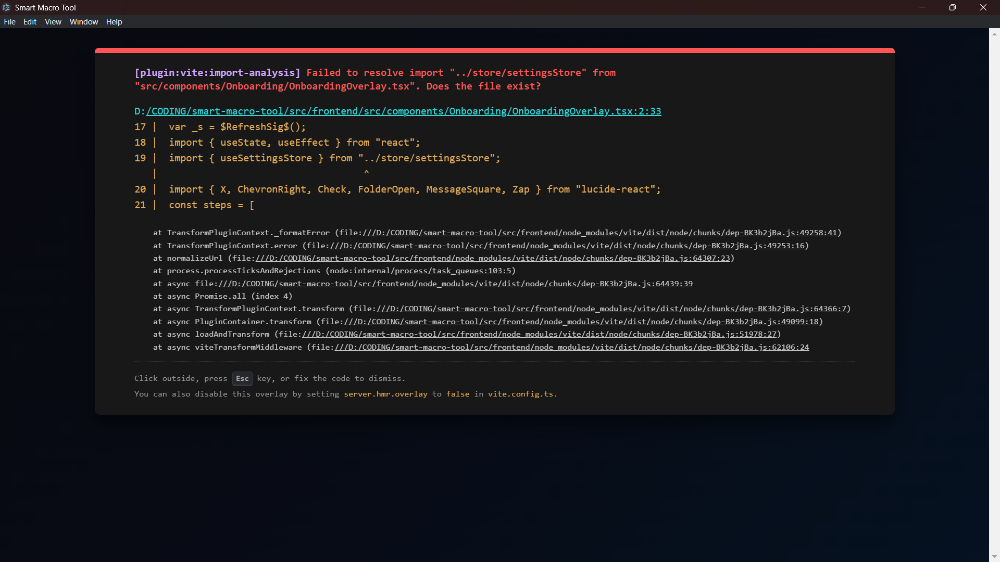

# 🤖 Smart Macro Tool

<p align="center">
  
</p>

<p align="center">
  <strong>AI-Powered Spreadsheet Automation Desktop App</strong>
</p>

<p align="center">
  <a href="https://github.com/MrTambe/smart-macro-tool/stargazers">
    
  </a>
  <a href="https://github.com/MrTambe/smart-macro-tool/network/members">
    
  </a>
  <a href="https://github.com/MrTambe/smart-macro-tool/blob/main/LICENSE">
    
  </a>
  <a href="https://github.com/MrTambe/smart-macro-tool/releases">
    
  </a>
</p>

---

## ✨ Features

<p align="center">
  
  
  
  
</p>

| Feature | Description |
|---------|-------------|
| 🤖 **AI Assistant** | Chat with AI to analyze data, generate insights |
| 📁 **File Management** | Open, save Excel, CSV, JSON files |
| ⚡ **Macros** | Record and replay repetitive tasks |
| 🌐 **Multi-AI** | Works with Ollama, OpenRouter, LM Studio |
| 🖥️ **Desktop App** | Runs as native Windows/Mac/Linux app |

---

## 🚀 Quick Start

### Download & Run

```
Double-click: Smart Macro Tool.bat
```

Or in terminal:
```bash
npm run dev
```

Then open: **http://localhost:5173**

---

## 📸 Screenshots

<p align="center">
  
  <br/><em>Main Dashboard</em>
</p>

---

## 🛠️ Tech Stack

<p align="center">
  
  
  
  
  
</p>

- **Frontend:** React, TypeScript, Vite, Electron, Tailwind CSS, AG Grid
- **Backend:** Python, FastAPI, Uvicorn
- **AI:** OpenRouter, Ollama, LM Studio

---

## 📁 Project Structure

```
smart-macro-tool/
├── src/
│   ├── frontend/          # React + Electron app
│   ├── backend/          # FastAPI Python server
│   └── core/             # Clean Architecture
├── assets/demo/          # Sample files
└── scripts/              # Setup scripts
```

---

## 🤝 Contributing

1. 🍴 Fork the repo
2. 🌿 Create branch: `git checkout -b feature/your-feature`
3. 📝 Commit: `git commit -m 'feat: add feature'`
4. 🚀 Push: `git push origin feature/your-feature`

---

## 📄 License

MIT License - See [LICENSE](LICENSE)

---

<p align="center">
  Made with ❤️ by <a href="https://github.com/MrTambe">MrTambe</a>
</p>
